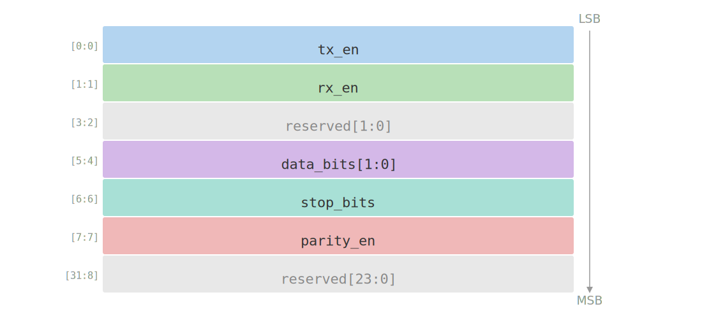
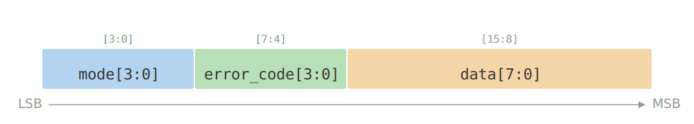
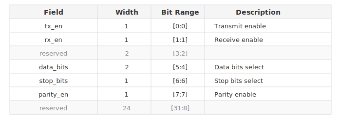

# Verilog Bitfield

An Obsidian plugin that renders Verilog bitfield definitions as interactive SVG diagrams and tables. Designed for chip frontend engineers to visualize bitfield layouts directly in their notes.

## Features

- **Unified syntax** — define bitfields with `name width description` and indented children
- **SVG bitfield diagram** — auto layout (horizontal/vertical) with dual-index labels: self-relative inside box, parent bit range outside as gray annotation
- **HTML table view** — toggle between diagram and table with one click
- **Cross-block references** — use `@block_name` to reference definitions across code blocks
- **Click to navigate** — click a `@reference` to scroll to the definition and highlight it
- **Hover preview** — hover over a `@reference` to see a tooltip preview of the definition
- **Auto-fill reserved** — unfilled bits are automatically padded with `reserved` at the MSB end
- **LSB-first allocation** — fields defined earlier get lower bits, matching Verilog convention
- **Up to 5 levels of nesting**

## Usage

Wrap your bitfield definitions in a `verilog-bitfield` code block:

````markdown
```verilog-bitfield
uart_ctrl 32 UART Control Register
    tx_en 1 Transmit enable
    rx_en 1 Receive enable
    reserved 2
    data_bits 2 Data bits select
    stop_bits 1 Stop bits select
    parity_en 1 Parity enable
```
````

The plugin renders it as an interactive bitfield diagram with dual-index labels:



Switch to table view with one click. Wider fields with shorter labels render horizontally:



The table view shows field name, bit width, bit range, and description with nested indentation:



### Cross-block references

Define blocks in one code block and reference them in another:

````markdown
```verilog-bitfield
uart_ctrl 32 UART Control Register
    tx_en 1 Transmit enable
    rx_en 1 Receive enable
    reserved 2
    data_bits 2 Data bits select

uart_status 32 UART Status Register
    tx_busy 1 Transmit busy
    rx_ready 1 Receive ready
```
````

````markdown
```verilog-bitfield
uart_regs 64 UART Register Block
    @uart_ctrl 32 Control
    @uart_status 32 Status
```
````

Click `@uart_ctrl` in the referencing block to jump to its definition.

## Installation

### From Obsidian Community Plugins

1. Open Settings → Community plugins
2. Search for "Verilog Bitfield"
3. Install and enable

### Manual

1. Download `main.js`, `manifest.json`, `styles.css` from the [latest release](https://github.com/aipyer/verilog-bitfield/releases/latest)
2. Create a folder `verilog-bitfield` in your vault's `.obsidian/plugins/` directory
3. Copy the three files into that folder
4. Enable the plugin in Settings → Community plugins

## License

MIT
