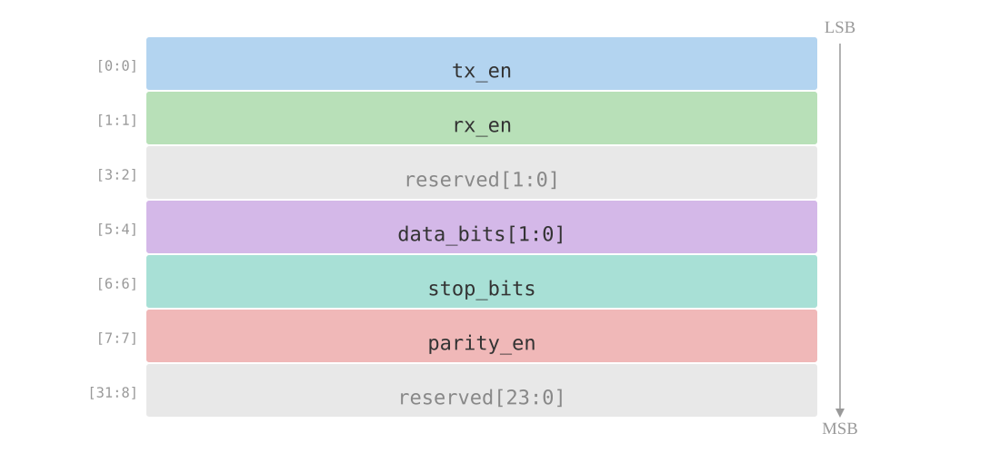
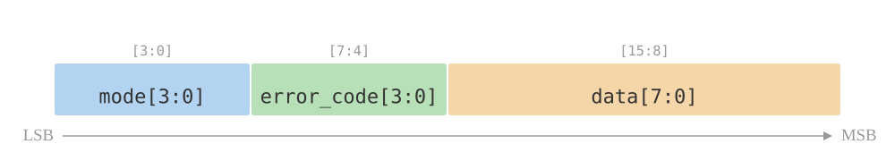
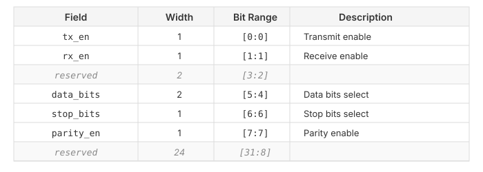

# Bitfield

一个 Obsidian 插件，将位域定义渲染为交互式 SVG 位域图和 HTML 表格。专为芯片前端工程师设计，方便直接在笔记中查看位域布局。

## 功能

- **统一语法** — 使用 `name width description` 和缩进子字段定义位域
- **SVG 位域图** — 自动布局（横向/纵向），双索引标签：框内显示自身相对索引，框外以灰色标注父级位范围
- **HTML 表格视图** — 一键切换位域图与表格
- **可配置主题** — 3 种 SVG 配色方案（pastel/vivid/mono）和 5 种表格风格（default/minimal/zebra/clean/dark-header）
- **可调行高** — SVG 和表格行高可分别通过滑块调节
- **跨块引用** — 使用 `@block_name` 在代码块之间引用其他定义
- **点击跳转** — 点击 `@引用` 可滚动到定义处并高亮显示
- **悬浮预览** — 鼠标悬停在 `@引用` 上可查看定义的 tooltip 预览
- **自动填充 reserved** — 未填完的位自动在 MSB 端填充 `reserved`
- **LSB 优先分配** — 先定义的字段获得低位的位，符合常见位域惯例
- **最多 5 层嵌套**

## 使用方法

将位域定义包裹在 `bitfield` 代码块中：

````markdown
```bitfield
uart_ctrl 32 UART 控制寄存器
    tx_en 1 发送使能
    rx_en 1 接收使能
    reserved 2
    data_bits 2 数据位选择
    stop_bits 1 停止位选择
    parity_en 1 校验使能
```
````

插件会将其渲染为交互式位域图，带有双索引标签：



一键切换为表格视图。字段较宽、标签较短时渲染为横向：



表格视图展示字段名、位宽、位范围及嵌套缩进的描述：



### 跨块引用

在一个代码块中定义块，在另一个代码块中引用：

````markdown
```bitfield
uart_ctrl 32 UART 控制寄存器
    tx_en 1 发送使能
    rx_en 1 接收使能
    reserved 2
    data_bits 2 数据位选择

uart_status 32 UART 状态寄存器
    tx_busy 1 发送忙
    rx_ready 1 接收就绪
```
````

````markdown
```bitfield
uart_regs 64 UART 寄存器块
    @uart_ctrl 32 控制
    @uart_status 32 状态
```
````

在引用块中点击 `@uart_ctrl` 即可跳转到其定义处。

## 安装

### 从 Obsidian 社区插件

1. 打开设置 → 社区插件
2. 搜索 "Bitfield"
3. 安装并启用

### 手动安装

1. 从 [最新 release](https://github.com/aipyer/bitfield/releases/latest) 下载 `main.js`、`manifest.json`、`styles.css`
2. 在 vault 的 `.obsidian/plugins/` 目录下创建 `bitfield` 文件夹
3. 将三个文件复制到该文件夹
4. 在设置 → 社区插件中启用该插件

## License

MIT
